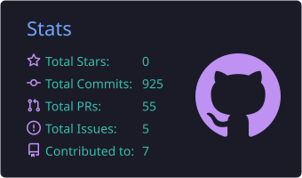
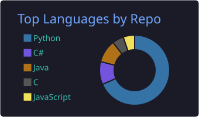
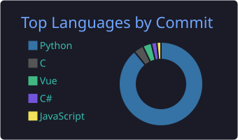

## 🙋‍♂️ 소개

- 🔭 **객체 탐지 연구** — YOLO 기반 위조 로고 탐지 연구를 진행하고 있어요
- 🧠 **VLM**(Vision-Language Model)과 **AI Agent**에 관심이 많습니다
- 📫 연락처: [oks706@gmail.com](mailto:oks706@gmail.com)

## 🔭 Projects

| 프로젝트 | 설명 | 기술 | 상태 |
|---|---|---|:---:|
| 🅿️ **주차장 CCTV Agent** | 주차장 다중 CCTV 영상을 관제·분석하는 중앙 AI 에이전트 | Python · VLM · Multi-Agent | 🚧 진행 중 |
| ⚾ **LG Aimers × LG 트윈스 해커톤** | 투수의 다음 투구 제구 성공 확률 예측 모델 | Python · ML | 🚧 진행 중 |

> 🔒 비공개 프로젝트는 공개 전환 시 저장소 링크가 추가됩니다.

## 🔧 기술 스택

## 🎓 수료 & 자격증

| 구분 | 이름 | 기관 | 시기 | 인증 |
|:---:|---|---|:---:|:---:|
| 수료 | AI Fundamentals | Google · Coursera | 2026.07 | [✅ 확인](https://coursera.org/verify/GPTT7C0TKJA9) |
| 수료 | AI for Brainstorming and Planning | Google · Coursera | 2026.07 | [✅ 확인](https://www.coursera.org/account/accomplishments/verify/5CODHCP4W6KX) |

## 📊 GitHub 스탯

## 🐍 잔디 스네이크

<picture>
  <source media="(prefers-color-scheme: dark)" srcset="https://raw.githubusercontent.com/oks706/oks706/output/github-snake-dark.svg" />
  <source media="(prefers-color-scheme: light)" srcset="https://raw.githubusercontent.com/oks706/oks706/output/github-snake.svg" />
  
</picture>

